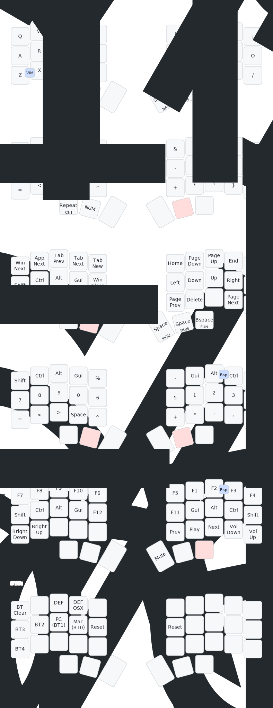

# zmk-chocofi

This is a [ZMK](https://zmk.dev) config repo for my 34/36-keys Chocofi keyboard,
arranged in 3 rows and 5 columns with 3 thumb keys on each side, using
the Colemak-DH layout (with toggleable QWERTY layout).
Residual keys for a 3x6 Corne layout are also present.

It uses a custom [fork](https://github.com/aaronkollasch/zmk) of ZMK to enable the
following features:
- Swapper implementation with `&macro_pause_for_layer`
- Display widget showing which modifiers are currently active

## Inspirations
- [Callum Oakley](https://github.com/callum-oakley/qmk_firmware/tree/master/users/callum)
- [Nick Faraco](https://github.com/nickfaraco/zmk-config)
- [Pascal Getreuer](https://getreuer.info/posts/keyboards/symbol-layer/index.html)
- [Ben Vallack](https://www.youtube.com/watch?v=8wZ8FRwOzhU)

## Reference layout

(Visualization generated with [@caksoylar/keymap](https://github.com/caksoylar/keymap-drawer))
